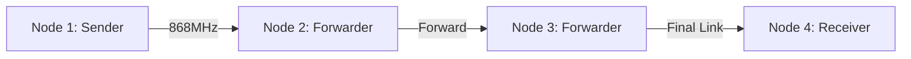

# 🌊 Underwater LoRa: 4-Node Multi-Hop Research Network

This project implements a high-reliability LoRa chain network designed to evaluate link quality in challenging environments, specifically for **underwater communication testing**. The system cycles through various physical layer parameters (SF and CR) to determine the optimal configuration for signal penetration and reliability.



## 🎯 Project Objectives

* **Acoustic vs. RF Analysis:** Evaluate LoRa's 868MHz performance in shallow-water environments.
* **Auto-Sync Benchmarking:** Test how multi-hop chains handle Spreading Factor (SF) transitions without manual intervention.
* **Link Quality Mapping:** Log RSSI and SNR data across 4 distinct configurations to map the "cliff effect" of LoRa underwater.

## ✨ Key Technical Features

### 1. Autonomous Test Cycling

The network automatically cycles through 4 major LoRa configurations to find the "sweet spot" for underwater transmission:

| Test | Spreading Factor | Coding Rate | Focus |
| --- | --- | --- | --- |
| **Test 1** | SF7 | 4/5 | Low latency/High bandwidth |
| **Test 2** | SF7 | 4/8 | Higher redundancy for noise |
| **Test 3** | SF12 | 4/5 | Maximum sensitivity/Long range |
| **Test 4** | SF12 | 4/8 | Maximum robustness |

### 2. Bulletproof Synchronization

* **The "LAST" Flag:** Node 1 signals the end of a test batch (100 packets).
* **Packet-Based Sync:** Forwarders (Nodes 2 & 3) extract the `NEXT` test name from the final packet to pre-configure their radios for the next cycle.
* **Emergency Scan Mode:** If a node loses sync (due to environment/interference), it enters an active "Scan Mode," cycling through all configurations until it re-locks onto the sender.

### 3. Data Integrity & Logging

* **Dual-Path Logging:** Every packet is logged to an onboard SD card and the Serial monitor for redundancy.
* **Forward-First Logic:** To prevent SPI bus conflicts, packets are forwarded *before* writing to the SD card to ensure the chain latency remains low.

## 📂 Repository Structure

* ` /Node1_Sender`: Logic for driving the test cycles and timing.
* ` /Node2_Forwarder`: Logic for packet verification, forwarding, and watchdog recovery.
* ` /Analysis`: Python scripts to parse `send2.txt` and generate RSSI/SNR plots.

## 🚀 Getting Started

### Hardware Requirements

* **Arduino MKR WAN 1310** (or similar SAMD21 + LoRa)
* **MicroSD Card Module** (connected via SPI)
* **Antennas** tuned to 868MHz (specifically optimized for your underwater enclosure)

### Configuration

1. **Set Node ID:** In `Node1.ino`, set `MY_ID = 1`.
2. **Set Forwarder ID:** In `Node2.ino`, set `MY_ID = 2` and `ACCEPT_FROM = 1`.
3. **Production Mode:** Ensure `#define QUICK_DEBUG` is **commented out** to run the full 100-packet test cycle.

## 📈 Example Data Output

The SD card generates a `sendX.txt` file in the following format, which can be directly imported into Excel or Python for analysis:

```text
test1_SF7_CR5|ID:2|num:042 RSSI:-105 SNR:-7.50 
```
